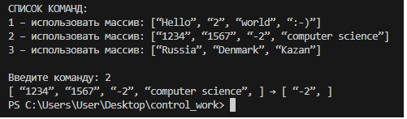

# Итоговая контрольная работа по основному блоку
Данная работа необходима для проверки ваших знаний и навыков по итогу прохождения первого блока обучения на программе Разработчик. Мы должны убедится, что базовое знакомство с IT прошло успешно.


1. Создать репозиторий на GitHub
2. Нарисовать блок-схему алгоритма (можно обойтись блок-схемой основной содержательной части, если вы выделяете её в отдельный метод)
3. Снабдить репозиторий оформленным текстовым описанием решения (файл README.md)
4. Написать программу, решающую поставленную задачу
5. Использовать контроль версий в работе над этим небольшим проектом (не должно быть так, что всё залито одним коммитом, как минимум этапы 2, 3, и 4 должны быть расположены в разных коммитах)

## Задача: Написать программу, которая из имеющегося массива строк формирует новый массив из строк, длина которых меньше, либо равна 3 символам. Первоначальный массив можно ввести с клавиатуры, либо задать на старте выполнения алгоритма. При решении не рекомендуется пользоваться коллекциями, лучше обойтись исключительно массивами.

**Примеры:**
```
[“Hello”, “2”, “world”, “:-)”] → [“2”, “:-)”]
[“1234”, “1567”, “-2”, “computer science”] → [“-2”]
[“Russia”, “Denmark”, “Kazan”] → [] 
``````

Решение: Блок-схема алгоритма:
 


### Код программы:

```cs
Commands();
string[] array = new string[] {};

string fromUser = ReadInput("Введите команду: ");
switch (fromUser)
{
    case "1":
        array = new string[] { "Hello", "2", "world", ":-)" };
        break;
    case "2":
        array = new string[] { "1234", "1567", "-2", "computer science" };
        break;
    case "3":
        array = new string[] { "Russia", "Denmark", "Kazan" };
        break;
    default:
        Console.WriteLine($"{fromUser} - Такой команды нет");
        break;
}


int lenNewArray = 0;
for (int i = 0; i <= array.Length - 1; i++)
{
    if (array[i].Length <= 3) lenNewArray++;
}

string[] newArray = new string[lenNewArray];
int idx = 0;

for (int i = 0; i <= array.Length - 1; i++)
{
    if (array[i].Length <= 3)
    {
        newArray[idx] = array[i];
        idx++;
    }
}

PrintArray(array);
Console.Write("→ ");
PrintArray(newArray);

// Функция: Вывод команд для работы с программой
void Commands()
{
    Console.WriteLine();
    Console.WriteLine("СПИСОК КОМАНД:");
    Console.WriteLine("1 – использовать массив: [“Hello”, “2”, “world”, “:-)”]");
    Console.WriteLine("2 – использовать массив: [“1234”, “1567”, “-2”, “computer science”]");
    Console.WriteLine("3 – использовать массив: [“Russia”, “Denmark”, “Kazan”]");
    Console.WriteLine();
}

// Функция ввода
string ReadInput(string msg)
{
    Console.Write(msg);
    return Console.ReadLine();
}

//  Функция вывода массива в терминал
void PrintArray(string[] array)
{
    Console.Write("[ ");
    for (int i = 0; i < array.Length; i++)
    {
        Console.Write($"“{array[i]}”, ");
    }
    Console.Write("] ");
}
```

**Результат вывода в терминал:**




